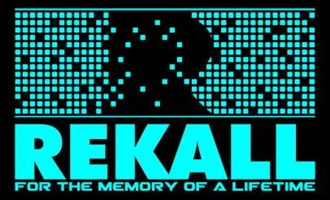

# Rekall.studio

> [!WARNING]
> rekall.studio is a personal project (Jesse Flygare) and POC intended to explore and demonstrate the capabilities of AI. It may use AI tools and services that do not provide robust protection of identity or misuse.

## Concept
rekall.studio is a homage to **[Rekall Industries](https://totalrecall.fandom.com/wiki/Rekall#Rekall)** from the classic 1990 film **[Total Recall](https://www.imdb.com/title/tt0100802/)**, reimagined as a webapp where users can create "memories" (images and videos) of themselves participating in ideal vacations or impossible adventures, as if they had actually lived them. Even spice things up with "ego trip" options, where users can assume an alternate identity.

The site focuses on:
- Ease of use: Zero learning curve and no AI experience is needed to use the site.
- Authenticity: Generated content is not gimmicky or contrived. If it were not so fantastical, it could pass as genuine.
- Quality over customization: User creativity is allowed within the limits of the theme.

The web app makes heavy use of generative AI models, tools and services. Models are trained on user images/video and then used to generate new media without the need for further image references or anchoring. AI is used to aid in the training of new models by filtering out and cleaning up (when possible) user provided media. This includes extracting the best training images from videos based on feature clarity, gesture diversity and full body captures. LoRAs and other strategies are used to maintain consistency and style accross models. AI is used to aid in the creation of naritives/promts for media generation.

At a high level, the typical workflow is:
1. User registers and establishes their persona via live photo and speech sampling
1. User imports (via upload or link) images and/or videos of themselves for model training
1. User selects preferred notification method of training completion
1. AI extracts trainable images from video
1. AI filters images to include only those of the user
1. AI enhances low resolution, blurry and low lit images
1. AI crops/removes unwanted elements so that only images suitable for model training remain
1. A clean base model is trained with the catalog of processed images
1. User is notified that studio is ready to use
1. User picks from pre-packaged memories or describes a custom memory
1. User customizes memory options and ego trip add-ons
1. AI validates custom requests against theme adherence and rejects or enhances/tunes it into a suitable prompt
1. AI generates itinerary for memory to drive image/video generations
1. AI generates images using user's trained model and selected memory prompts
1. AI generates videos using the generated images as references on a video capable model
1. User sees content associated with their chosen memory as it becomes available and a status of queued generations
1. User can delete generated content and elect to generate more for an existing memory
1. User can start a new memory workflow

## Website
The style of Rekall.studio is inspired by, and uses elements (fonts, tones, mood, etc...) from Rekall Industries in the film.
In particular:
- The [**Rekall Industries** commercial](docs/inspiration/rekall-commercial.mp4)
- Consultation visit to [**Rekall Industries** office](docs/inspiration/rekall-visit.mp4)

The similarities and references should be obvious to anyone familiar with the film.

### Landing page
https://rekall.studio landing page gives users a taste of what memories they have missed, or are missing out on, but can create using the site.

>*Would you like to ski Antarctica...  but snowed under with work?  
Do you dream of a vacation at the bottom of the ocean... but you can't float the bill?  
Have you always wanted to climb the mountains of Mars... but now you're over the hill?  
Then come to recall.studio, where you can create the memory of your ideal vacation, cheaper, safer and better than the real thing.*

Users can login or register for free (no credit card or payment method required) from the landing page.
News and announcements are displayed

### App
https://app.rekall.studio provides a workspace where registered users can manage the training of their model(s), the creation of new memories (and ego trip add-ons) and manage existing memories. Users can also manage thier identity (avatar and speech sampling), account profile, preferences/settings and billing. The style is inspired by the Total Recall movie, without being overly retro. The user should feel like they are visiting [**Rekall Industries** office](docs/inspiration/rekall-visit.mp4) from the film, cold/clinical/clean. The generated memories, in contrast, should feel viseral/deep/alive.

New users must first establish their persona before accessing training and memory features. The free tier limits features to (TBD). Paid tiers unlock more features, including images, then videos, then custom memories.

## Development
### AI
I (Jesse Flygare) am using this project as an exploration and demonstration of AI as a development tool. My intention is to utilize current AI agentic development practices during the full development lifecycle of this project:

1. Project vision refinement and roadmap planning
1. AI ecosystem and tools (models, agents, skills, harnesses, workflows, MCP, IDE, etc...) decisions/definitions
1. Project tech stack (languages, frameworks, database, auth, monorepo, etc...) decisions/definitions
1. Project ecosystem (hosting, ci/cd, issue tracking, observability, documentation, etc...) decisions/definitions
1. Project management (planning, prioritization, timelines, estimations, status updates) decisions/definitions
1. Product managment (requirements, features, use cases, user stories, etc...) decisions/definitions
1. Product design (UI/UX, layouts, style, theme, hero images, etc...) decisions/definitions
1. Product architecture (frontends, APIs, peristance layers, integrations/dependencies, coding standards/guardrails, etc...) decisions/definitions
1. Product release management (branch strategy, versioning, release notes, hotfixes, test/demo/prod environments, A:B/Canery/Rolling deployments, etc...) decisions/definitions
1. Project/Product refactoring (support small/medium/large changes to entire project if needed as experiments are tried and discoveries are made)

**As this is a POC/exploration, AI strategies should avoid vender lock and favor free/low-cost options wherever possible.**

### Deliverables
**These are likely to change as details are vetted further.**

The concept above describes an ideal, fully functional product, where the cost of running the product is subsidized by paid usage. As a POC/educational project, there is no expectation that this will become a monitized product. AI services are expected to be the only prohibitivly expensive cost of running/hosting this project publicily. Unless an alternative form of subsidizing these costs is found, the project will use a BYOK strategy.

The training of models (including the scrubbing of provided user images) as described in the concept above is arguably the most technically/legistically challenging and potentially most expensive feature. Until the opportunity to vet this further becomes available, the use of image anchors will need to suffice in the generation of images/movies.

#### Milestone 1 (initial setup)
Goal: Tooling and workflows in place to continue rapid development with AI. Ability to define/refine agent behavior as needed.

- Project repo created
- rekall.studio domain aqquired
- Local development setup decided and documented
- AI ecosystem and tools decided and documented
- AI repo scafolding in place (AGENTS.md, skills, rules, workflows, etc...)
- Project tech stack is decided and documented
- Project ecosystem is decided and documented

#### Milestone 2 (initial landing page)
Goal: Have asthetic of product defined and placeholder landing page deployed to https://rekall.studio

- Product asthetics/style is defined/documented
- Signin/Signup feature replaced with "Comming Soon"
- Landing page designed, hero graphics generated
- Landing page deployable to local, test, prod environments via automation

#### Milestone 3 (app core)
Goal: Implement layout and core features (non memory generation features) for https://app.rekall.studio

- Backend infrastructure provisioned
- Signup/Signin feature implemented
- Profile and preferences feature implemented
- Online help/user guide started
- Frontend and backend deployable via automation
- Logging/observability/telemetry implemented

#### Milestone 4 (basic memory feature)
Goal: User can select from limited list of available "memories". User uploads reference photo at time of generation. User is provided selected number of generated images for memory. Memory is populated with generated images and itinerary for user to view/manage.

- Text-to-image (with reference image) support implemented
- Initial memories inspired from film (ski antarctica, under sea hotel, saturn cruise, visit mars)
- Manage memories feature implemented
- Help/user guide updated
- Out of scope: User personas, ego trips, video generation, custom memories, reference image validation, reference image refinement/pre-processing

#### Milestone 5 (movie memory feature)
Goal: User can optionally add the generation of a movie (background music only) to a memory.

- Text-to-movie (with reference image) support implemented (background music, no spoken words)
- Movie added to list of managed memory artifacts
- Help/user guide updated
- Out of scope: User personas, ego trips, custom memories, reference image validation, reference image refinement/pre-processing

#### Milestone 6 (ego trip feature)
Goal: User can optionally choose from a limited list of available "ego trip" identities to add-on to a memory.

- Generations updated to support ego trip context
- Initial "ego trip" identities inspired from film (millionare playboy, sports hero, industrial tycoon, secret agent)
- Help/user guide updated
- Memory features updated
- Out of scope: User personas, custom memories, reference image validation, reference image refinement/pre-processing

#### Milestone 7 (user persona)
Goal: User establishes a "persona" used for validating provided reference images, enhancing prompt context and adding voice to videos

- User uploads clear face image from live capture (or consider integrating with existing services that provide same purpose)
- User uploads live voice recording (or consider integrating with existing service)
- User descibes themselves as context to use in memory generations
- Face recognition/identification support implemented
- LipSync text-to-video support implemented
- Update memory management features to validate provided reference images
- Update memory management features to support optional spoken content in movie generation
- Help/user guide updated
- Out of scope: custom memories, reference image refinement/pre-processing

#### Milestone 8 (custom memories)
Goal: User can optionally describe a custom memory instead of selecting from pre-defined list

- User provided memory description captured
- Memory description validated for theme/terms of use compliance
- Description to prompt capability
- Memory management features updated
- Help/user guide updated
- Out of scope: reference image refinement/pre-processing

### Milestone 9 (reference image pre-processing)
Goal: User is able to upload reference image of any quality/resolution and it is cleaned up to be made suitable for generation anchoring

- text-to-image edit support implemented
- Memory management features updated
- Help/user guide updated
